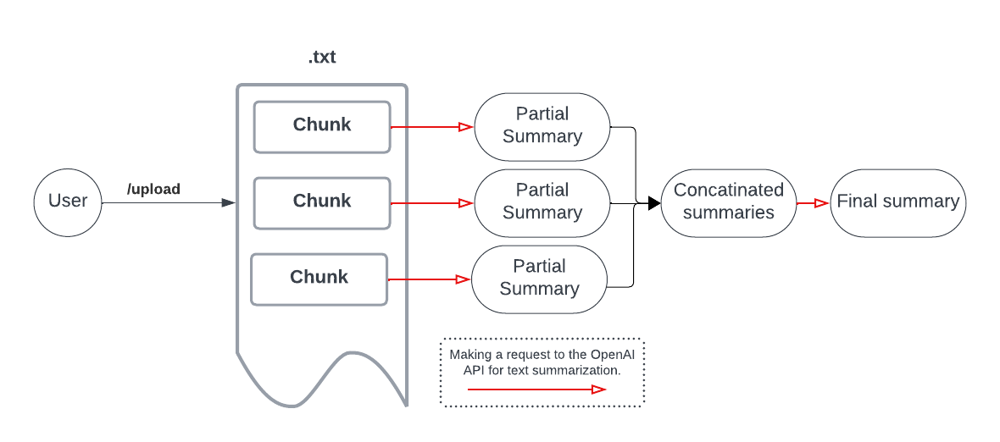

# Simple Summarization API using OpenAI and 🦜

This application prepares coherent and concise summaries for `.txt` files.

## How It Works




Users upload `.txt` documents through the `/upload` endpoint. Upon receiving a document, the application:

1. Splits the document into manageable segments.
2. Processes each segment through a pipeline that utilizes LangChain 🦜 and the OpenAI API, generating summaries for each segment.
3. Combines these summaries into a final document that captures the essence of the original text.

## Limitations

- **OpenAI API Dependence**: The functionality of this application depends on the availability and responsiveness of the OpenAI API. Downtime or rate limits imposed by the API will directly affect the application's performance.
- **Non-scalable**: This application is intended to be used by only one user simultaneously.
- **Language Support**: The application can process documents in any language supported by GPT-4, but the output summaries are provided exclusively in English.
- **Document Length**: The application is designed to reject documents that are too short (less than 100 symbols) as summarizing a single sentence or very brief documents generally does not provide value. Similarly, excessively long documents may be truncated or rejected to prevent abuse and ensure compliance with OpenAI API limitations (up to 100,000 symbols).

## Building Locally [Development Only]

To set up and run the application on your local machine, follow these steps:

1. **Install Dependencies**:

   Execute the following command:

   ```bash
   pip install -r requirements.txt
   ```


2. **Environment Variables**:
Write your `OPENAI_API_KEY` to the `.env`.

1. **Run the Application**:

```
uvicorn app.main:app --reload
```

This command starts a local development server. Access the application by navigating to `http://localhost:8000` in your web browser.

## Deploying on Render [Production]

To deploy the application on Render.com, a Dockerfile is prepared. Follow these steps:

1. **Create a New Web Service on Render**:
- Log into your Render account and select "New Web Service".
- Connect it to this GitHub repository.
2. **Configure the Web Service**:
- Set environment variable `OPENAI_API_KEY` in the Render service settings.
3. **Enjoy**  the app using the link provided by Render.

